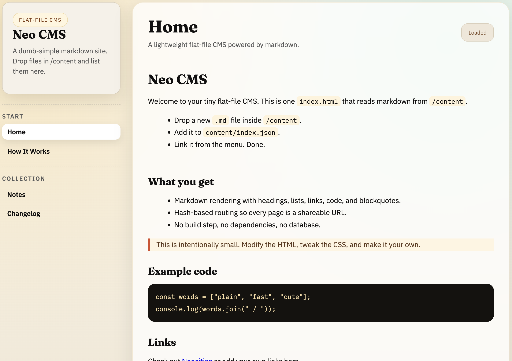

# neo-cms

Neo CMS is a lightweight, static content site starter built with NeoCities.org in mind. It ships as a single-page site with a tiny JS layer and a simple `content/` folder you can edit without build tools.

## What is this?

- A minimal, file-based CMS for small personal sites on NeoCities.
- Works with plain HTML, CSS, and JavaScript.
- Designed to be edited locally and uploaded to your NeoCities site.

## Quick start (NeoCities)

1. Create a NeoCities site if you do not have one yet.
2. Open `index.html` in a browser to preview locally.
3. Edit markdown or HTML files in `content/` to update pages.
4. Customize behavior and data loading in `neo-cms.js`.
5. Tweak styles in `style.css`.
6. Upload the updated files to your NeoCities site.

## Project links

- Live site: <https://crowdersoup.neocities.org/>

## License

MIT. See [`LICENSE`](LICENSE)
